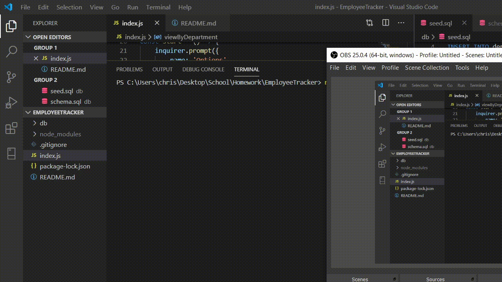

# Employeetracker
Employee Tracker

Allow user to manage empoyees using a mysql database. 

The database has three tables employees, roles, and departments.

Employees have roles and managers, and roles have departments.

Inquirer is used to prompt the user with choices to view and modify 

the database. 

